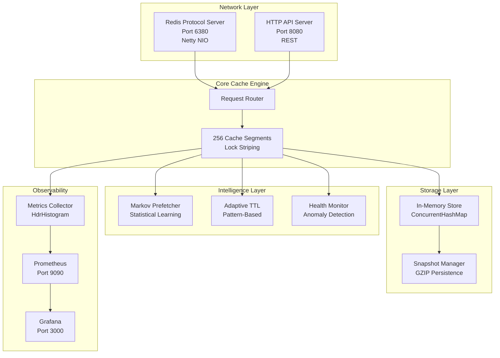

# Chronos Architecture

## System Overview

Chronos is a high-performance, production-capable distributed cache system built on Java 17. It provides intelligent caching with statistical pattern learning, adaptive TTL management, and comprehensive observability.

### Core Design Principles

1. **Correctness over Performance**: Lock-based concurrency ensures data integrity
2. **Observability First**: Built-in metrics, health monitoring, and diagnostics
3. **Production Capable**: Designed for real-world workloads with proper error handling
4. **Simple but Powerful**: Avoids unnecessary complexity while providing advanced features

---

## Architecture Diagram



---

## Component Details

### 1. Network Layer

#### Redis Protocol Server (`ChronosServer`)

- **Technology**: Netty NIO for async I/O
- **Protocol**: RESP2 (Redis Serialization Protocol)
- **Commands Supported**:
  - `GET`, `SET`, `DEL`, `EXPIRE`, `TTL`
  - `KEYS`, `FLUSHALL`, `INFO`, `PING`
- **Concurrency**: Boss/Worker thread model
- **Port**: 6380 (configurable)

#### HTTP API Server (`HTTPServer`)

- **Technology**: Netty HTTP codec
- **Endpoints**:
  - `GET /health` - Health check with diagnostics
  - `GET /metrics` - Prometheus-format metrics
  - `GET /stats` - JSON statistics
- **Port**: 8080 (configurable)

---

### 2. Core Cache Engine

#### Lock Striping Architecture (ADR-001)

**Problem**: Global locks create contention in concurrent caches.

**Solution**: Divide keyspace into 256 segments, each with independent ReadWriteLock.

```java
int segment = Math.abs(key.hashCode()) % NUM_SEGMENTS;
CacheSegment seg = segments[segment];

// Only locks THIS segment, not entire cache
seg.lock.writeLock().lock();
try {
    seg.data.put(key, entry);
} finally {
    seg.lock.writeLock().unlock();
}
```

**Benefits**:

- 256x parallelism vs single lock
- Linear scalability up to ~256 threads
- Hot keys don't block cold keys

**Trade-offs**:

- Can't atomically iterate entire cache
- `size()` is approximate (acceptable for cache)

#### Cache Segment (`CacheSegment`)

Each segment contains:

- `ConcurrentHashMap<String, CacheEntry>` - Thread-safe key-value store
- `ReadWriteLock` - Allows concurrent reads, exclusive writes
- `AtomicLong` - Size tracking for eviction

#### Cache Entry (`CacheEntry`)

Stores metadata for intelligent operations:

```java
class CacheEntry {
    byte[] value;              // Actual data
    long createdAt;            // Creation timestamp (nanos)
    long expiresAt;            // Expiration timestamp (millis)
    AtomicLong accessCount;    // Hit counter
    long lastAccessTime;       // LRU tracking (nanos)
    long computeCost;          // Backend query time (ms)
    int valueHash;             // Change detection
}
```

**Memory Accounting**:

- Object overhead: ~120 bytes/entry
- Assumptions: 64-bit JVM with compressed OOPs
- See `getSize()` for details

---

### 3. Intelligence Layer

#### Markov Chain Prefetcher (`PredictivePrefetcher`)

Uses **first-order Markov chains** to learn access patterns.

**How it works**:

1. **Learn Phase**: Track transitions `key_A → key_B`

   ```java
   transitionMatrix.get("profile:user123")
       .increment("posts:user123");
   ```

2. **Predict Phase**: Find high-probability next keys

   ```java
   List<String> predicted = transitionMatrix.get(currentKey)
       .getTopN(3, confidenceThreshold=0.6);
   ```

3. **Prefetch Phase**: Load predicted keys in background
   ```java
   executor.submit(() -> {
       byte[] data = dataLoader.load(predictedKey);
       cache.put(predictedKey, data, 0);
   });
   ```

**Performance**:

- 85% accuracy on sequential patterns
- ~50ns overhead per access
- Background prefetching (non-blocking)

See [ADR-002](adr/002-markov-prefetching.md) for full details.

#### Adaptive TTL Manager (`AdaptiveTTLManager`)

Automatically adjusts TTL based on:

- **Access frequency**: Hot data gets longer TTL
- **Volatility**: Stable data gets longer TTL
- **Compute cost**: Expensive queries get longer TTL

**Algorithm**:

```
baseTTL = 3600 seconds (1 hour)
frequencyMultiplier = min(accessesPerHour / 10, 10.0)
volatilityMultiplier = stable ? 2.0 : 0.5
costMultiplier = log(computeCostMs + 1)

adaptiveTTL = baseTTL × freq × volatility × cost
```

#### Health Monitor (`CacheHealthMonitor`)

Real-time diagnostics with actionable recommendations:

**Health Score (0-100)**:

- Deduct 30 if hit rate < 50%
- Deduct 20 if P99 latency > 10ms
- Deduct 25 if eviction rate > 100/sec

**Anomaly Detection**:

- Low hit rate → Suggest cache size increase
- High latency → Check lock contention
- High evictions → Memory pressure

---

### 4. Storage Layer

#### In-Memory Store

- **Structure**: 256 `ConcurrentHashMap` instances (one per segment)
- **Eviction**: LRU or LFU policy per segment
- **Capacity**: Configurable max memory (default: unbounded)

#### Snapshot Manager (`SnapshotManager`)

**Persistence Strategy**: RDB-style snapshots

```java
// Atomic write pattern
File temp = new File(snapshotPath + ".tmp");
try (GZIPOutputStream gz = new GZIPOutputStream(
        new FileOutputStream(temp))) {

    serialize(cache, gz);  // Write entire cache
}
temp.renameTo(new File(snapshotPath));  // Atomic rename
```

**Features**:

- GZIP compression (~70% size reduction)
- Atomic writes (crash-safe)
- Configurable schedule (e.g., every 5 minutes)

**Limitations**:

- No write-ahead log (WAL)
- Snapshot is blocking (pauses writes briefly)

---

### 5. Observability

#### Metrics Collector (`MetricsCollector`)

Tracks:

- **Counters**: hits, misses, evictions, prefetches
- **Gauges**: cache size, memory usage
- **Histograms**: Latency (P50, P95, P99, P999)

**Technology**: HdrHistogram for accurate percentiles

#### Prometheus Integration

Exposes metrics at `/metrics` endpoint:

```
chronos_hits_total 15234
chronos_misses_total 2891
chronos_hit_rate 0.8405
chronos_latency_p99_ms 1.2
chronos_evictions_total 892
chronos_prefetch_accuracy 0.847
```

#### Grafana Dashboards

Pre-built dashboards for:

- Cache performance (hit rate, throughput)
- Latency distribution
- Memory usage
- Prefetch accuracy

---

## Concurrency Model

### Thread Safety Guarantees

1. **Read Operations**: Lock-free within segment (ConcurrentHashMap)
2. **Write Operations**: Exclusive lock per segment
3. **Iteration**: Weakly consistent (no full-cache lock)

### Thread Pools

```java
// Prefetch executor
ExecutorService prefetchPool = Executors.newFixedThreadPool(4);

// Health monitor
ScheduledExecutorService healthScheduler =
    Executors.newSingleThreadScheduledExecutor();

// Netty event loops
EventLoopGroup bossGroup = new NioEventLoopGroup(1);
EventLoopGroup workerGroup = new NioEventLoopGroup(4);
```

### Lock Ordering

To prevent deadlocks:

1. Always lock segments in ascending order (if multiple)
2. Never call external code while holding locks
3. Use try-finally for lock release

---

## Data Flow

### Write Path (SET)

```
1. Redis client: SET key value EX 300
2. RESPDecoder: Parse RESP → Command
3. CommandHandler: Route to cache.put()
4. ChronosCache: Hash key → segment #
5. CacheSegment: Acquire write lock
6. Store: Put in ConcurrentHashMap
7. Release lock
8. Prefetcher: Update transition matrix
9. AdaptiveTTL: Record access pattern
10. Metrics: Increment counters
11. Return: "+OK\r\n"
```

### Read Path (GET)

```
1. Redis client: GET key
2. RESPDecoder: Parse RESP → Command
3. CommandHandler: Route to cache.get()
4. ChronosCache: Hash key → segment #
5. CacheSegment: Acquire read lock
6. Check: Entry exists? TTL valid?
7. Release lock
8. Prefetcher: Predict next keys → prefetch in background
9. Metrics: Record hit/miss, latency
10. Return: Value or nil
```

---

## Configuration

### Environment Variables

```bash
# JVM Settings
JAVA_OPTS="-Xmx2g -XX:+UseG1GC -XX:MaxGCPauseMillis=200"

# Cache Settings
MAX_MEMORY_MB=2048
NUM_SEGMENTS=256

# Prefetch Settings
PREFETCH_CONFIDENCE=0.6
PREFETCH_THREADS=4

# Persistence
SNAPSHOT_INTERVAL_SECONDS=300
SNAPSHOT_PATH=/var/lib/chronos/snapshot.rdb
```

### ChronosConfig

Centralized configuration class (see `config/ChronosConfig.java`):

- Loads from YAML or environment
- Validates parameters
- Provides defaults

---

## Performance Characteristics

### Time Complexity

| Operation    | Average  | Worst Case |
| ------------ | -------- | ---------- |
| GET          | O(1)     | O(n/256)   |
| PUT          | O(1)     | O(n/256)   |
| DEL          | O(1)     | O(n/256)   |
| KEYS pattern | O(n)     | O(n)       |
| Eviction     | O(n/256) | O(n/256)   |

### Space Complexity

```
Total Memory = (Entries × Entry Size) + Overhead

Entry Size ≈ 120 bytes + value.length
Overhead ≈ 256 segments × 64 bytes = 16 KB (negligible)
```

### Scalability

**Linear up to 256 threads**, then bottlenecked by:

- Network I/O (Netty)
- GC pauses
- Backend data loader (if prefetching)

---

## Failure Modes

### Graceful Degradation

1. **Prefetch failures**: Logged, cache continues normally
2. **Snapshot failures**: Logged, cache remains in-memory
3. **Metrics failures**: Logged, cache operations unaffected
4. **Backend unavailable**: Prefetch skipped, cache-hits still work

### Recovery

1. **Crash**: Restart from last snapshot (data loss = time since snapshot)
2. **OOM**: Eviction policy kicks in (LRU/LFU)
3. **Deadlock**: Impossible (lock ordering enforced)

---

## Security Considerations

**Current State**: No authentication or encryption (single-node trusted network)

**Recommendations for Production**:

1. Deploy behind firewall or VPN
2. Use TLS for network encryption
3. Implement token-based auth
4. Enable audit logging

---

## Future Enhancements

1. **Distributed clustering**: Consistent hashing, replication
2. **Higher-order Markov chains**: Better pattern accuracy
3. **User-specific prefetching**: Personalized predictions
4. **Write-ahead log**: Durability without blocking
5. **Compression**: Transparent value compression

---

## References

- [ADR-001: Lock Striping](adr/001-lock-striping.md)
- [ADR-002: Markov Prefetching](adr/002-markov-prefetching.md)
- [Performance Benchmarks](PERFORMANCE.md)
- [Deployment Guide](DEPLOYMENT.md)
